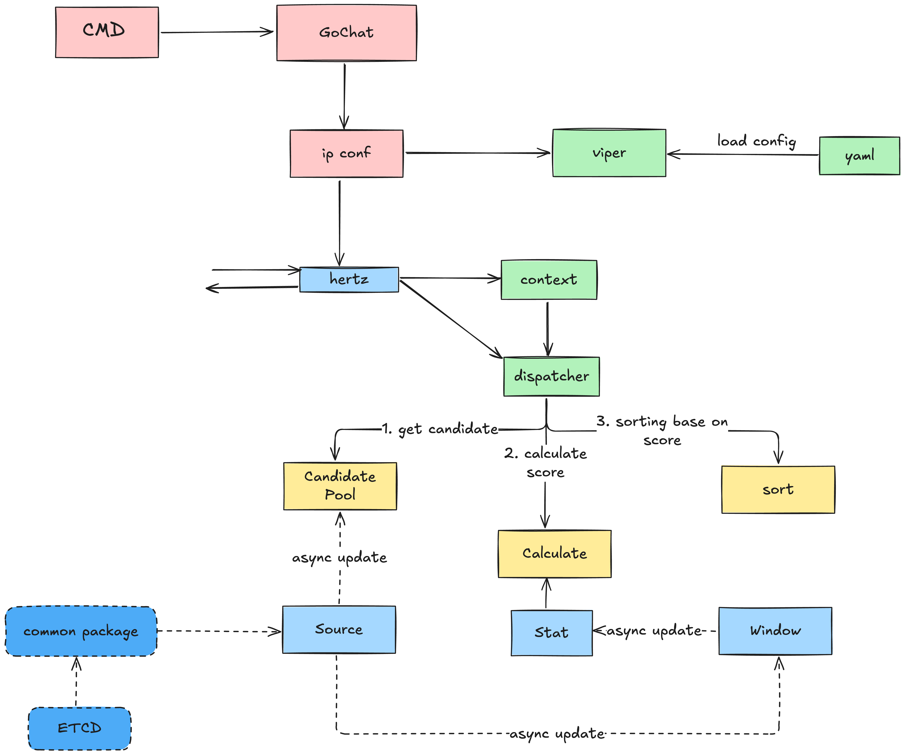

# GoChat - A Distributed IM System 🚀

GoChat is a high-performance distributed instant messaging system built with Go, featuring a microservices architecture and custom RPC framework.

## Architecture Overview 🏗️

### System Components

1. **Gateway Server** 🌐
   - Handles TCP connections and message routing
   - Uses epoll for high-performance I/O
   - Manages connection lifecycle
   - Communicates with State Server via gRPC

2. **State Server** 💾
   - Manages user session state
   - Handles message persistence
   - Coordinates between Gateway and IPConf

3. **IPConf Server** 🔧
   - Service discovery and configuration
   - Load balancing
   - Service health monitoring

4. **Custom RPC Framework (CRPC)** ⚡
   - Built on top of gRPC
   - Service discovery integration
   - Load balancing support
   - Tracing and metrics

### Architecture Diagrams

#### Gateway and State-Server Communication


#### IPConf Service Discovery


## Features ✨

- High-performance TCP connection handling with epoll
- Custom RPC framework for service communication
- Service discovery and load balancing
- Distributed architecture
- Real-time message delivery
- Session state management
- Metrics and tracing support

## Prerequisites 📋

- Go 1.22 or higher
- Protocol Buffers compiler
- Docker (for Redis and etcd services)
- Make

## Quick Start 🚀

### 1. Start External Services

We provide a script to start all required external services (etcd and Redis):

```bash
chmod +x scripts/start-services.sh

./scripts/start-services.sh
```

### 2. Build and Run

```bash
# Build all components
make all

# Start services in different process
./bin/gochat state
./bin/gochat gateway
./bin/gochat ipconf
./bin/gochat client
```

### 3. Verify Services

You can verify the services are running correctly:

```bash
# Check etcd
curl http://localhost:2379/version

# Check Redis
redis-cli ping
```
```

## Future Plans ��

### Phase 1: Core Features
- [ ] User authentication and authorization
- [ ] Message persistence with Redis
- [ ] Group chat functionality
- [ ] Message delivery status

### Phase 2: Advanced Features
- [ ] File transfer support
- [ ] Voice messages
- [ ] Message encryption
- [ ] User presence system

### Phase 3: Scalability
- [ ] Horizontal scaling support
- [ ] Message queue integration
- [ ] Cache layer implementation
- [ ] Performance optimization

## Contributing 🤝

Contributions are welcome! Please feel free to submit a Pull Request.

## License 📄

This project is licensed under the MIT License - see the LICENSE file for details.
```

