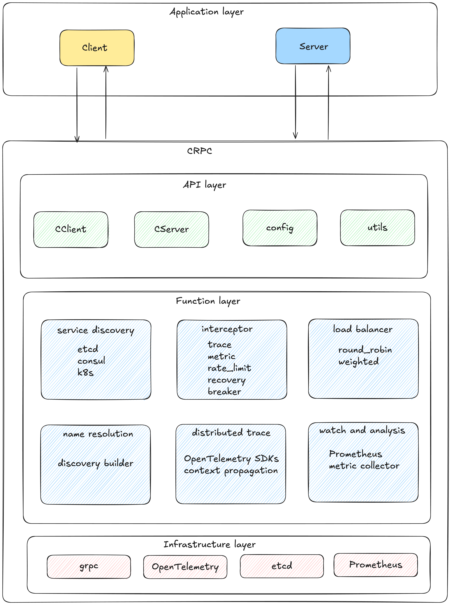

# CRPC - GoChat's RPC Framework

CRPC (Chat RPC) is the core communication framework for the GoChat project. Built on top of gRPC, it provides rich service governance capabilities including service discovery, load balancing, distributed tracing, monitoring, rate limiting, and circuit breaking. This framework aims to simplify microservice development and maintenance while improving system reliability, observability, and scalability.

## Architecture



## Core Features

### 1. Versatile Service Discovery
- **Multiple Registry Centers**:
  - **Etcd**: Lightweight distributed key-value store providing high-availability service registration and discovery
  - **Consul**: Service mesh solution with built-in health checking
  - **Kubernetes**: Native integration with K8s service discovery mechanisms
- **Dynamic Endpoint Updates**: Automatically updates client connection pools when service instances change
- **Health Checking**: Automatically detects and removes unhealthy service instances

### 2. Intelligent Load Balancing
- **Multiple Strategies**: Supports round-robin, weighted load balancing algorithms
- **Service Discovery Integration**: Dynamically adjusts load distribution based on service health status
- **Transparent Access**: Clients don't need to be concerned with specific service instance selection

### 3. Comprehensive Observability
- **Distributed Tracing**:
  - Implemented based on OpenTelemetry standards
  - Provides end-to-end tracing capabilities across service calls
  - Compatible with Jaeger, Zipkin, and other tracing systems
- **Metrics Monitoring**:
  - Collects key metrics like RPC call count, latency, and error rates
  - Supports Prometheus metric export
  - Visualizes service running status and performance bottlenecks

### 4. Robust Service Governance
- **Rate Limiting Protection**:
  - Supports both client and server-side rate limiting
  - Prevents service overload and resource exhaustion
- **Circuit Breaking**:
  - Automatically isolates unstable dependent services
  - Protects overall system stability
- **Timeout Control**:
  - Granular request timeout settings
  - Avoids long-term blocking

### 5. Simple and Intuitive API
- **Encapsulates Complexity**: Hides the underlying details of gRPC and service governance
- **Consistent Interface**: Provides unified client and server development experience
- **Low Invasiveness**: Compatible with standard gRPC development, easy to migrate and learn

## Technical Architecture

CRPC adopts a layered design, including from bottom to top:

1. **Infrastructure Layer**: Relies on gRPC, OpenTelemetry, and other open-source technologies
2. **Function Layer**: Implements core features like service discovery, interceptor chains, load balancing
3. **API Layer**: Provides simple-to-use interfaces like CClient and CServer
4. **Application Layer**: Business services built on CRPC for microservice communication

## Quick Start

### Server Example

```go
// Create CRPC server
server := crpc.NewCServer("example-service", 8080)

// Register gRPC service
pb.RegisterExampleServiceServer(server.Server(), &ExampleServiceImpl{})

// Start the server
if err := server.Start(); err != nil {
    log.Fatalf("Failed to start server: %v", err)
}
```

### Client Example

```go
// Create CRPC client
client, err := crpc.NewCClient("example-service")
if err != nil {
    log.Fatalf("Failed to create client: %v", err)
}

// Create service client
exampleClient := pb.NewExampleServiceClient(client.Conn())

// Call service
resp, err := exampleClient.ExampleMethod(ctx, &pb.ExampleRequest{...})
```

## Configuration and Extension

CRPC is designed to be highly configurable and extensible:

1. **Custom Interceptors**: Add custom interceptors to extend functionality
2. **Configuration Options**: Adjust framework behavior through configuration files or environment variables
3. **Plugin Mechanism**: Support for adding new service discovery and load balancing implementations

## Future Plans

1. Support for more service discovery mechanisms
2. Enhanced security with TLS encryption and authentication
3. Implementation of additional load balancing strategies
4. More comprehensive developer documentation and best practices guides

